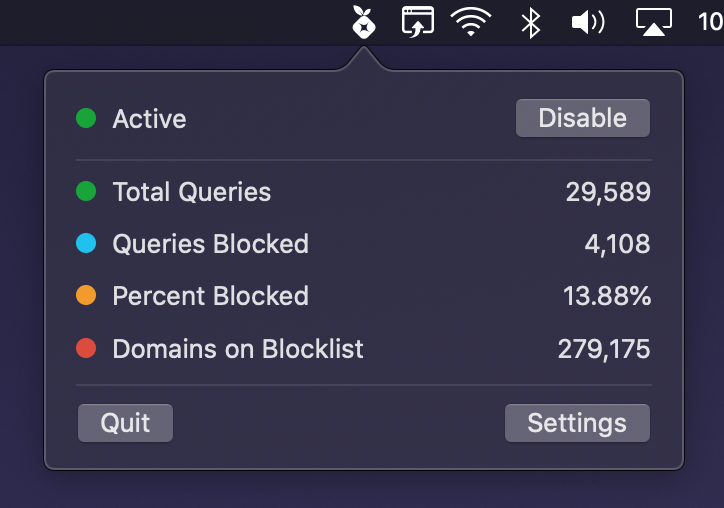

  

# Hole Stats

Follow up and manage the status of your [Pi-hole](https://github.com/pi-hole/pi-hole) with this simple macOS app that lives in your menu bar.

## Authentication Token
In order to use the "enable/disable" button you need to add your Authentication Token in the Settings screen.

There are two different ways to get your authentication token:

- /etc/pihole/setupVars.conf under WEBPASSWORD
- WebUI -> Settings -> API -> Show API Token

## Screenshots
   

## Requirement
This project uses SwiftUI which requires macOS Catalina.

Tested with Pi-hole 4.4 and 5.0

## Download
Hole Stats (and [SwiftHole](https://github.com/Bunn/SwiftHole)) is free and open source project of mine. If you want to support its development you can pay any amount you want on Gumroad :)

[Download the latest version here](https://gum.co/iqhwv)