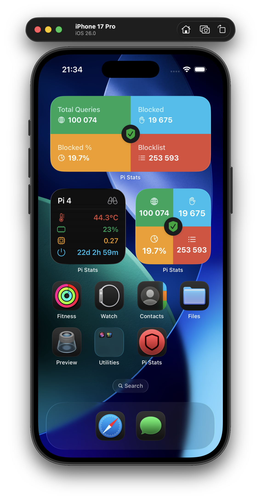

  

# Pi Stats

Follow up and manage the status of your [Pi-hole(s)](https://github.com/pi-hole/pi-hole) with this native iOS and macOS app.

Monitor your Pi-hole instances right from your iPhone, iPad, or Mac menu bar. Pi Stats provides a beautiful, modern interface to keep track of your network-wide ad blocking statistics.

**Supports Pi-hole 5.x and 6.x versions**

## Features

- Real-time monitoring of Pi-hole statistics
-  Quick enable/disable controls for your Pi-hole
-  Native iOS app with widgets support
-  macOS menu bar app for quick access
-  Secure credential storage in Keychain
-  Beautiful charts and metrics
-  Support for multiple Pi-hole instances

## Authentication Token
In order to use the "enable/disable" button you need to add your Authentication Token in the Settings screen.

**For Pi-hole 5.x**, there are two different ways to get your authentication token:

- /etc/pihole/setupVars.conf under WEBPASSWORD
- WebUI -> Settings -> API -> Show API Token

**For Pi-hole 6.x**, use the same password you use to log into the web interface.

## Troubleshooting

### Can't Connect to Pi-hole (API Sessions Exceeded)

If you're unable to connect to your Pi-hole but other apps or websites can access it successfully, you may be encountering the `apiSeatsExceeded` error. This happens when the maximum number of concurrent API sessions has been reached.

**How to fix:**

You can increase the API session limit by modifying the `webserver.api.max_sessions` setting:

1. **Via configuration file**: Edit `/etc/pihole/pihole.toml` on your Pi-hole server
2. **Via Web GUI**: Navigate to Settings → Expert Settings (All Settings) and search for `webserver.api.max_sessions`

**About this setting:**

`webserver.api.max_sessions` controls the number of concurrent sessions allowed for the API. If the number of sessions exceeds this value, no new sessions will be allowed until existing sessions expire or are logged out. Note that this setting is only relevant when authentication is enabled.

## Screenshots

### iOS

  
  
  

### macOS

  

## Requirements

- **iOS**: iOS 26.0 or later (iPhone, iPad)
- **macOS**: macOS Sequoia (15.2) or later

Tested with Pi-hole 5.x and 6.x versions

## Download

Pi Stats (and [SwiftHole](https://github.com/Bunn/SwiftHole)) is a free and open source hobby project of mine. If you want to support its development, you can download the apps using the options below:

### macOS
- **[Mac App Store](https://apps.apple.com/us/app/pi-stats/id1514075262?ls=1)** - Recommended for automatic updates
- **[Gumroad](https://gum.co/iqhwv)** - Pay what you want (direct download)

### iOS
- **[iOS App Store](https://apps.apple.com/us/app/id1523024268)** - Available for iPhone and iPad

  

